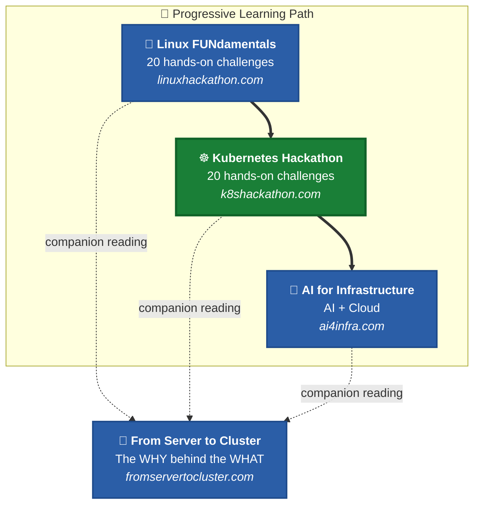

# 🚀 FastHack Kubernetes

### From Server to Cluster — A Hands-on Hackathon for Linux Professionals

[](https://github.com/ricmmartins/fasthack-kubernetes/actions/workflows/validate.yml)
[](https://opensource.org/licenses/MIT)
[](https://kubernetes.io/)
[](https://kind.sigs.k8s.io/)
[]()
[]()
[]()
[]()

## Introduction

This is a hands-on learning resource designed for **Linux professionals** who want to master Kubernetes. If you already understand processes, networking, storage, and security in Linux — you're ready to orchestrate all of that at scale.

This hackathon bridges the gap between traditional Linux system administration and modern cloud-native infrastructure. Every concept is taught through the lens of what you already know.

> **"You don't need to start from zero. You need to evolve."**

> Note: This Hackathon follows the same format as the [Linux FUNdamentals Hackathon](https://linuxhackathon.com/) — the 1st Linux Hackathon by Microsoft, part of [What The Hack](http://aka.ms/wth).

## Learning Path

This hackathon is the natural next step after the [Linux FUNdamentals Hackathon](https://linuxhackathon.com/):



## Learning Objectives

In this hackathon, you will be challenged with real-world tasks that Linux professionals face when transitioning to Kubernetes:

1. Understand containers as Linux processes with isolation
2. Create and manage Kubernetes clusters locally
3. Deploy, scale, and update applications declaratively
4. Configure networking, DNS, and traffic routing
5. Implement persistent storage for stateful workloads
6. Secure clusters with RBAC, Pod Security Admission, and Network Policies
7. Set up monitoring with Prometheus and Grafana
8. Automate deployments with Helm and Kustomize
9. Diagnose and fix real-world Kubernetes failures
10. Deploy to managed Kubernetes services (AKS, EKS, GKE)

## Challenges

Each challenge builds on the previous one, but can also be done independently after Challenge 03. The complexity increases progressively.

- Challenge 01: **[Your First Container](Student/Challenge-01.md)**
  - Understand containers as isolated Linux processes. Build, run, and inspect containers with Docker or Podman.

- Challenge 02: **[From Container to Pod](Student/Challenge-02.md)**
  - Create your first Kubernetes Pod and understand how it relates to Linux processes and containers.

- Challenge 03: **[Creating a Local Cluster](Student/Challenge-03.md)**
  - Set up a Kubernetes cluster with Kind or Minikube. Explore kubeconfig, contexts, and the kube-system namespace.

- Challenge 04: **[Deployments and Rolling Updates](Student/Challenge-04.md)**
  - Deploy applications with replicas, perform rolling updates and rollbacks. Understand resource requests and limits.

- Challenge 05: **[Services and Networking](Student/Challenge-05.md)**
  - Expose applications with Services (ClusterIP, NodePort). Understand Pod-to-Pod communication and CoreDNS.

- Challenge 06: **[Ingress and Gateway API](Student/Challenge-06.md)**
  - Route external HTTP traffic into your cluster using Ingress Controllers and the new Gateway API.

- Challenge 07: **[Volumes and Persistence](Student/Challenge-07.md)**
  - Configure persistent storage with PV, PVC, and StorageClass. Understand the difference between ephemeral and persistent data.

- Challenge 08: **[ConfigMaps and Secrets](Student/Challenge-08.md)**
  - Externalize application configuration. Manage sensitive data with Secrets and understand encryption at rest.

- Challenge 09: **[Security: RBAC and Pod Security](Student/Challenge-09.md)**
  - Control access with ServiceAccounts, Roles, and RoleBindings. Apply Pod Security Admission and Network Policies.

- Challenge 10: **[Autoscaling and Resource Management](Student/Challenge-10.md)**
  - Configure Horizontal Pod Autoscaler, Metrics Server, and Probes (liveness, readiness, startup).

- Challenge 11: **[Helm, Kustomize, and GitOps](Student/Challenge-11.md)**
  - Package applications with Helm charts. Customize deployments with Kustomize overlays. Introduction to GitOps.

- Challenge 12: **[Observability: Prometheus and Grafana](Student/Challenge-12.md)**
  - Deploy a monitoring stack. Query metrics with PromQL. Build dashboards and configure alerts.

- Challenge 13: **[Troubleshooting: Break and Fix](Student/Challenge-13.md)**
  - Diagnose and resolve 5 real-world failure scenarios: CrashLoopBackOff, DNS failures, storage issues, and more.

- Challenge 14: **[Deploy to the Cloud](Student/Challenge-14.md)**
  - Deploy your application to a managed Kubernetes service. Compare AKS (Azure), EKS (AWS), and GKE (Google Cloud).

- Challenge 15: **[Pod Scheduling & Resource Management](Student/Challenge-15.md)**
  - Master taints, tolerations, node/pod affinity, topology spread, static Pods, ResourceQuotas, LimitRanges, and PodDisruptionBudgets.

- Challenge 16: **[Container Image Engineering](Student/Challenge-16.md)**
  - Build optimized container images with Dockerfiles, multi-stage builds, registries, and Podman.

- Challenge 17: **[Advanced Deployment Strategies](Student/Challenge-17.md)**
  - Implement blue/green, canary, and recreate deployments. Handle API deprecations.

- Challenge 18: **[kubeadm Cluster Administration](Student/Challenge-18.md)** ⚠️ *Requires VMs*
  - Bootstrap clusters with kubeadm, perform upgrades, backup/restore etcd, explore CRDs and Operators.

- Challenge 19: **[Cluster Security & Hardening](Student/Challenge-19.md)** ⚠️ *Requires VMs*
  - CIS benchmarks, audit logging, TLS Ingress, ServiceAccount hardening, Secrets encryption at rest.

- Challenge 20: **[Supply Chain & Runtime Security](Student/Challenge-20.md)** ⚠️ *Mixed (Kind + VMs)*
  - Image scanning (Trivy), SBOM, cosign, AppArmor, seccomp, Falco, static analysis, container immutability.

## Certification Coverage

This hackathon covers **100% of CKA, CKAD, and CKS exam domains**:

| Certification | Challenges | Lab Environment |
|---|---|---|
| **CKA** (Certified Kubernetes Administrator) | 01–15, 18 | Kind + VMs |
| **CKAD** (Certified Kubernetes Application Developer) | 01–12, 16–17 | Kind |
| **CKS** (Certified Kubernetes Security Specialist) | 09, 18–20 | Kind + VMs |

> 📝 See the [CNCF Curriculum](https://github.com/cncf/curriculum) for official exam domains. Practice exams available at [Killer.sh](https://killer.sh/).

## Linux ↔ Kubernetes Quick Reference

| Linux Concept | Kubernetes Equivalent | Description |
|---|---|---|
| Process (PID) | Pod | Unit of execution |
| `systemctl` / `init.d` | Controller Manager / Scheduler | Lifecycle management |
| `iptables` / `firewalld` | NetworkPolicy / CNI | Traffic control |
| `/etc/fstab` / `mount` | PersistentVolume / PVC | Storage and persistence |
| `root` / `sudoers` | ClusterRole / RoleBinding | Access control |
| `top` / `ps` / `vmstat` | `kubectl top` / Metrics Server | Resource monitoring |
| `journalctl` / `syslog` | `kubectl logs` / Prometheus | Log collection |
| `crontab` | CronJob / Job | Scheduled tasks |
| `yum` / `apt` | Helm / Kustomize | Package management |
| `hostname` / DNS | CoreDNS / Pod IP | Name resolution |
| Namespaces / cgroups | Container Runtime / Pods | Isolation |

## Prerequisites

- **Complete the [Linux FUNdamentals Hackathon](https://linuxhackathon.com/)** or have equivalent Linux experience (processes, networking, storage, permissions, shell scripting)
- **Docker or Podman** installed and running (`docker ps` or `podman ps` should work)
- **kubectl** installed ([install guide](https://kubernetes.io/docs/tasks/tools/install-kubectl-linux/))
- **Kind** installed ([install guide](https://kind.sigs.k8s.io/docs/user/quick-start/#installation)) — used as the default cluster for all challenges
- **Helm** installed ([install guide](https://helm.sh/docs/intro/install/))
- A terminal with bash or zsh (Linux, macOS, or Windows with WSL2)
- 4 GB of free RAM (recommended)
- No cloud account required for Challenges 01–13 and 15–17 (Challenge 14 requires a cloud provider; Challenges 18–20 require VMs)

### Tested Versions

| Tool | Version | Notes |
|------|---------|-------|
| Kubernetes | v1.36 | Via Kind |
| kubectl | v1.36 | Match cluster version |
| Kind | v0.27+ | Default cluster tool |
| Helm | v3.17+ | For Challenge 11-12 |
| Docker | 27.x+ | Container runtime |

> ⚠️ **Accuracy Commitment**: Every command, YAML manifest, and lab in this hackathon has been tested end-to-end. If you find any issues, please [open an issue](https://github.com/ricmmartins/fasthack-kubernetes/issues).

## Cloud-Agnostic Approach

This hackathon teaches **Kubernetes-native concepts first** — all core challenges (01–13) run on a local cluster with Kind. No cloud account or credit card needed.

Challenge 14 provides multi-cloud deployment variants:

| Provider | CLI | Managed Service |
|----------|-----|-----------------|
| Azure | `az aks` | AKS |
| AWS | `eksctl` | EKS |
| Google Cloud | `gcloud container` | GKE |

## Learning Resources

- [Kubernetes Official Documentation](https://kubernetes.io/docs/)
- [Kubernetes Blog](https://kubernetes.io/blog/)
- [CNCF Training & Certifications](https://www.cncf.io/training/)
- [Killer.sh](https://killer.sh/) — CKA/CKAD exam simulator
- [Killercoda](https://killercoda.com/) — Interactive scenarios in browser
- [KodeKloud](https://kodekloud.com/) — Guided practice and labs
- [Play with Kubernetes](https://labs.play-with-k8s.com/) — Temporary online cluster
- [The Kubernetes Book](https://www.amazon.com/Kubernetes-Book-Nigel-Poulton-ebook/dp/B072TS9ZQZ) — Nigel Poulton
- [Kubernetes Up & Running](https://www.oreilly.com/library/view/kubernetes-up-and/9781098110192/) — Kelsey Hightower, Brendan Burns

## Certification Path

After completing this hackathon, you'll be well-prepared for:

```
KCNA → CKA → CKAD → CKS
(Fundamentals)  (Admin)  (Developer)  (Security)
```

## Coach's Guide

In the [Coach](./Coach/) directory you'll find guidelines for running this Hackathon as an event, plus solutions for all challenges. If you're doing this as a student, **don't look at the solutions** — go learn something. 🙂

## Contributions

Contributions in the form of bug reports, feature requests, and PRs are always welcome. Please follow these steps before submitting a PR:

1. Create an issue describing the bug or feature request
2. Clone the repository and create a topic branch
3. Make changes, testing all commands and manifests
4. Submit a PR

## Related Projects

- 🐧 [Linux FUNdamentals Hackathon](https://linuxhackathon.com/) — Master Linux basics first
- 📖 [From Server to Cluster](https://fromservertocluster.com/) — Kubernetes book for Linux professionals
- 🤖 [AI for Infrastructure Professionals](https://ai4infra.com/) — AI workloads on infrastructure you build
- ☁️ [Azure Governance Made Simple](https://book.azgovernance.com/) — Cloud governance handbook

## 🌐 Portuguese Content

🇧🇷 **This hackathon is also available in Brazilian Portuguese!**
Check out the [`pt-br`](https://github.com/ricmmartins/fasthack-kubernetes/tree/pt-br) branch for the full translated version of all challenges, coach guides, and documentation.

For additional articles, tutorials, and resources on Linux, Kubernetes, and Cloud Infrastructure in Portuguese, visit **[ricardomartins.com.br](https://ricardomartins.com.br)**.

## Show Your Support

Give a ⭐️ if this content helped you!

---

**Disclaimer:** This is an independent, personal project — not an official Microsoft publication. The views and content are solely the author's own. The concepts, architectures, and operational practices in this hackathon apply to any Kubernetes distribution — AKS, EKS, GKE, k3s, or bare-metal.

Created by **[Ricardo Martins](https://rmmartins.com)** — Principal Solutions Engineer @ Microsoft
