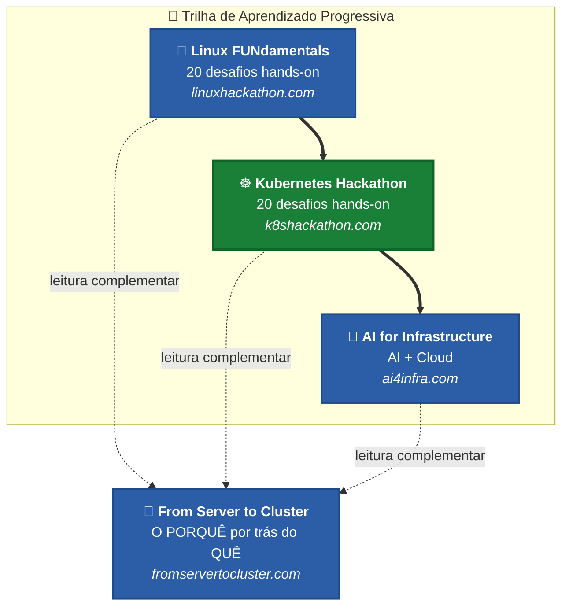

# 🚀 FastHack Kubernetes

### Do Servidor ao Cluster — Um Hackathon Hands-on para Profissionais Linux

[](https://github.com/ricmmartins/fasthack-kubernetes/actions/workflows/validate.yml)
[](https://opensource.org/licenses/MIT)
[](https://kubernetes.io/)
[](https://kind.sigs.k8s.io/)
[]()
[]()
[]()
[]()

🇺🇸 **Este hackathon também está disponível em Inglês!** Confira o branch [`en-us`](https://github.com/ricmmartins/fasthack-kubernetes/tree/en-us) para a versão em inglês de todos os desafios, guias do coach e documentação.

## Introdução

Este é um recurso de aprendizado hands-on projetado para **profissionais Linux** que desejam dominar Kubernetes. Se você já entende processos, rede, armazenamento e segurança em Linux — você está pronto para orquestrar tudo isso em escala.

Este hackathon preenche a lacuna entre a administração tradicional de sistemas Linux e a infraestrutura moderna cloud-native. Cada conceito é ensinado através da perspectiva do que você já conhece.

> **"Você não precisa começar do zero. Você precisa evoluir."**

> Nota: Este Hackathon segue o mesmo formato do [Linux FUNdamentals Hackathon](https://linuxhackathon.com/) — o 1º Linux Hackathon da Microsoft, parte do [What The Hack](http://aka.ms/wth).

## Trilha de Aprendizado

Este hackathon é o próximo passo natural após o [Linux FUNdamentals Hackathon](https://linuxhackathon.com/):



## Objetivos de Aprendizado

Neste hackathon, você será desafiado com tarefas do mundo real que profissionais Linux enfrentam na transição para Kubernetes:

1. Entender containers como processos Linux com isolamento
2. Criar e gerenciar clusters Kubernetes localmente
3. Implantar, escalar e atualizar aplicações de forma declarativa
4. Configurar rede, DNS e roteamento de tráfego
5. Implementar armazenamento persistente para workloads stateful
6. Proteger clusters com RBAC, Pod Security Admission e Network Policies
7. Configurar monitoramento com Prometheus e Grafana
8. Automatizar deployments com Helm e Kustomize
9. Diagnosticar e corrigir falhas reais em Kubernetes
10. Fazer deploy em serviços gerenciados de Kubernetes (AKS, EKS, GKE)

## Desafios

Cada desafio se baseia no anterior, mas também pode ser feito de forma independente após o Desafio 03. A complexidade aumenta progressivamente.

- Desafio 01: **[Seu Primeiro Container](Student/Challenge-01.md)**
  - Entenda containers como processos Linux isolados. Construa, execute e inspecione containers com Docker ou Podman.

- Desafio 02: **[De Container para Pod](Student/Challenge-02.md)**
  - Crie seu primeiro Pod Kubernetes e entenda como ele se relaciona com processos e containers Linux.

- Desafio 03: **[Criando um Cluster Local](Student/Challenge-03.md)**
  - Configure um cluster Kubernetes com Kind ou Minikube. Explore kubeconfig, contexts e o namespace kube-system.

- Desafio 04: **[Deployments e Rolling Updates](Student/Challenge-04.md)**
  - Implante aplicações com réplicas, realize rolling updates e rollbacks. Entenda resource requests e limits.

- Desafio 05: **[Services e Rede](Student/Challenge-05.md)**
  - Exponha aplicações com Services (ClusterIP, NodePort). Entenda comunicação Pod-a-Pod e CoreDNS.

- Desafio 06: **[Ingress e Gateway API](Student/Challenge-06.md)**
  - Roteie tráfego HTTP externo para dentro do seu cluster usando Ingress Controllers e a nova Gateway API.

- Desafio 07: **[Volumes e Persistência](Student/Challenge-07.md)**
  - Configure armazenamento persistente com PV, PVC e StorageClass. Entenda a diferença entre dados efêmeros e persistentes.

- Desafio 08: **[ConfigMaps e Secrets](Student/Challenge-08.md)**
  - Externalize a configuração da aplicação. Gerencie dados sensíveis com Secrets e entenda criptografia em repouso.

- Desafio 09: **[Segurança: RBAC e Pod Security](Student/Challenge-09.md)**
  - Controle o acesso com ServiceAccounts, Roles e RoleBindings. Aplique Pod Security Admission e Network Policies.

- Desafio 10: **[Autoscaling e Gerenciamento de Recursos](Student/Challenge-10.md)**
  - Configure Horizontal Pod Autoscaler, Metrics Server e Probes (liveness, readiness, startup).

- Desafio 11: **[Helm, Kustomize e GitOps](Student/Challenge-11.md)**
  - Empacote aplicações com Helm charts. Personalize deployments com Kustomize overlays. Introdução ao GitOps.

- Desafio 12: **[Observabilidade: Prometheus e Grafana](Student/Challenge-12.md)**
  - Implante uma stack de monitoramento. Consulte métricas com PromQL. Construa dashboards e configure alertas.

- Desafio 13: **[Troubleshooting: Break and Fix](Student/Challenge-13.md)**
  - Diagnostique e resolva 5 cenários de falha do mundo real: CrashLoopBackOff, falhas de DNS, problemas de armazenamento e mais.

- Desafio 14: **[Deploy na Nuvem](Student/Challenge-14.md)**
  - Faça deploy da sua aplicação em um serviço gerenciado de Kubernetes. Compare AKS (Azure), EKS (AWS) e GKE (Google Cloud).

- Desafio 15: **[Agendamento de Pods e Gerenciamento de Recursos](Student/Challenge-15.md)**
  - Domine taints, tolerations, afinidade de node/pod, topology spread, static Pods, ResourceQuotas, LimitRanges e PodDisruptionBudgets.

- Desafio 16: **[Engenharia de Imagens de Container](Student/Challenge-16.md)**
  - Construa imagens de container otimizadas com Dockerfiles, multi-stage builds, registries e Podman.

- Desafio 17: **[Estratégias Avançadas de Deployment](Student/Challenge-17.md)**
  - Implemente deployments blue/green, canary e recreate. Lide com deprecações de API.

- Desafio 18: **[Administração de Cluster com kubeadm](Student/Challenge-18.md)** ⚠️ *Requer VMs*
  - Bootstrap de clusters com kubeadm, realize upgrades, backup/restore do etcd, explore CRDs e Operators.

- Desafio 19: **[Segurança e Hardening de Cluster](Student/Challenge-19.md)** ⚠️ *Requer VMs*
  - CIS benchmarks, audit logging, TLS Ingress, hardening de ServiceAccount, criptografia de Secrets em repouso.

- Desafio 20: **[Supply Chain e Segurança em Runtime](Student/Challenge-20.md)** ⚠️ *Misto (Kind + VMs)*
  - Escaneamento de imagens (Trivy), SBOM, cosign, AppArmor, seccomp, Falco, análise estática, imutabilidade de containers.

## Cobertura de Certificação

Este hackathon cobre **100% dos domínios dos exames CKA, CKAD e CKS**:

| Certificação | Desafios | Ambiente de Lab |
|---|---|---|
| **CKA** (Certified Kubernetes Administrator) | 01–15, 18 | Kind + VMs |
| **CKAD** (Certified Kubernetes Application Developer) | 01–12, 16–17 | Kind |
| **CKS** (Certified Kubernetes Security Specialist) | 09, 18–20 | Kind + VMs |

> 📝 Consulte o [CNCF Curriculum](https://github.com/cncf/curriculum) para os domínios oficiais dos exames. Simulados disponíveis em [Killer.sh](https://killer.sh/).

## Referência Rápida Linux ↔ Kubernetes

| Conceito Linux | Equivalente Kubernetes | Descrição |
|---|---|---|
| Processo (PID) | Pod | Unidade de execução |
| `systemctl` / `init.d` | Controller Manager / Scheduler | Gerenciamento de ciclo de vida |
| `iptables` / `firewalld` | NetworkPolicy / CNI | Controle de tráfego |
| `/etc/fstab` / `mount` | PersistentVolume / PVC | Armazenamento e persistência |
| `root` / `sudoers` | ClusterRole / RoleBinding | Controle de acesso |
| `top` / `ps` / `vmstat` | `kubectl top` / Metrics Server | Monitoramento de recursos |
| `journalctl` / `syslog` | `kubectl logs` / Prometheus | Coleta de logs |
| `crontab` | CronJob / Job | Tarefas agendadas |
| `yum` / `apt` | Helm / Kustomize | Gerenciamento de pacotes |
| `hostname` / DNS | CoreDNS / Pod IP | Resolução de nomes |
| Namespaces / cgroups | Container Runtime / Pods | Isolamento |

## Pré-requisitos

- **Completar o [Linux FUNdamentals Hackathon](https://linuxhackathon.com/)** ou ter experiência equivalente em Linux (processos, rede, armazenamento, permissões, shell scripting)
- **Docker ou Podman** instalado e funcionando (`docker ps` ou `podman ps` deve funcionar)
- **kubectl** instalado ([guia de instalação](https://kubernetes.io/docs/tasks/tools/install-kubectl-linux/))
- **Kind** instalado ([guia de instalação](https://kind.sigs.k8s.io/docs/user/quick-start/#installation)) — usado como cluster padrão para todos os desafios
- **Helm** instalado ([guia de instalação](https://helm.sh/docs/intro/install/))
- Um terminal com bash ou zsh (Linux, macOS, ou Windows com WSL2)
- 4 GB de RAM livre (recomendado)
- Nenhuma conta de nuvem é necessária para os Desafios 01–13 e 15–17 (Desafio 14 requer um provedor de nuvem; Desafios 18–20 requerem VMs)

### Versões Testadas

| Ferramenta | Versão | Notas |
|------|---------|-------|
| Kubernetes | v1.36 | Via Kind |
| kubectl | v1.36 | Corresponder à versão do cluster |
| Kind | v0.27+ | Ferramenta padrão de cluster |
| Helm | v3.17+ | Para Desafios 11-12 |
| Docker | 27.x+ | Container runtime |

> ⚠️ **Compromisso com a Precisão**: Cada comando, manifesto YAML e laboratório neste hackathon foi testado de ponta a ponta. Se encontrar algum problema, por favor [abra uma issue](https://github.com/ricmmartins/fasthack-kubernetes/issues).

## Abordagem Agnóstica de Nuvem

Este hackathon ensina **conceitos nativos de Kubernetes primeiro** — todos os desafios principais (01–13) rodam em um cluster local com Kind. Nenhuma conta de nuvem ou cartão de crédito necessário.

O Desafio 14 fornece variantes de deploy multi-cloud:

| Provedor | CLI | Serviço Gerenciado |
|----------|-----|-----------------|
| Azure | `az aks` | AKS |
| AWS | `eksctl` | EKS |
| Google Cloud | `gcloud container` | GKE |

## Recursos de Aprendizado

- [Documentação Oficial do Kubernetes](https://kubernetes.io/docs/)
- [Blog do Kubernetes](https://kubernetes.io/blog/)
- [Treinamento e Certificações CNCF](https://www.cncf.io/training/)
- [Killer.sh](https://killer.sh/) — Simulador de exames CKA/CKAD
- [Killercoda](https://killercoda.com/) — Cenários interativos no navegador
- [KodeKloud](https://kodekloud.com/) — Prática guiada e laboratórios
- [Play with Kubernetes](https://labs.play-with-k8s.com/) — Cluster online temporário
- [The Kubernetes Book](https://www.amazon.com/Kubernetes-Book-Nigel-Poulton-ebook/dp/B072TS9ZQZ) — Nigel Poulton
- [Kubernetes Up & Running](https://www.oreilly.com/library/view/kubernetes-up-and/9781098110192/) — Kelsey Hightower, Brendan Burns

## Trilha de Certificação

Após completar este hackathon, você estará bem preparado para:

```
KCNA → CKA → CKAD → CKS
(Fundamentos)  (Admin)  (Developer)  (Segurança)
```

## Guia do Coach

No diretório [Coach](./Coach/) você encontrará diretrizes para conduzir este Hackathon como evento, além de soluções para todos os desafios. Se você está fazendo como estudante, **não olhe as soluções** — vá aprender algo. 🙂

## Contribuições

Contribuições na forma de relatórios de bugs, solicitações de funcionalidades e PRs são sempre bem-vindas. Por favor, siga estes passos antes de enviar um PR:

1. Crie uma issue descrevendo o bug ou a funcionalidade solicitada
2. Clone o repositório e crie um branch de tópico
3. Faça as alterações, testando todos os comandos e manifestos
4. Envie um PR

## Projetos Relacionados

- 🐧 [Linux FUNdamentals Hackathon](https://linuxhackathon.com/) — Domine os fundamentos de Linux primeiro
- 📖 [From Server to Cluster](https://fromservertocluster.com/) — Livro de Kubernetes para profissionais Linux
- 🤖 [AI for Infrastructure Professionals](https://ai4infra.com/) — Workloads de IA na infraestrutura que você constrói
- ☁️ [Azure Governance Made Simple](https://book.azgovernance.com/) — Manual de governança em nuvem

## 🌐 English Content

Looking for content in English? Check out the [`en-us`](https://github.com/ricmmartins/fasthack-kubernetes/tree/en-us) branch for the English version of all challenges, coach guides, and documentation.

## Mostre seu Apoio

Dê uma ⭐️ se este conteúdo te ajudou!

---

**Aviso:** Este é um projeto pessoal e independente — não é uma publicação oficial da Microsoft. As opiniões e o conteúdo são exclusivamente do autor. Os conceitos, arquiteturas e práticas operacionais neste hackathon se aplicam a qualquer distribuição Kubernetes — AKS, EKS, GKE, k3s ou bare-metal.

Criado por **[Ricardo Martins](https://rmmartins.com)** — Principal Solutions Engineer @ Microsoft
